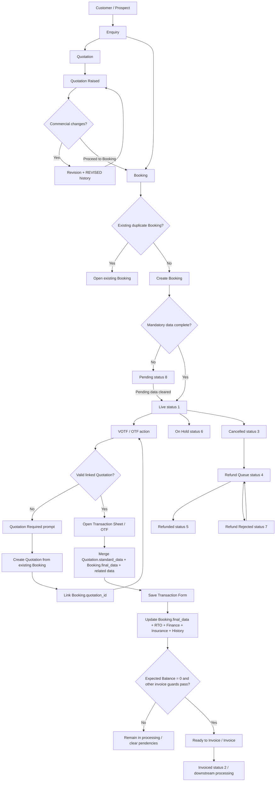

# Functional Requirements Specification (FRS)
## Xceler8 DMS — Combined End-to-End Business Process

**Document Type:** Combined End-to-End Functional Requirement Specification  
**Version:** 1.0  
**Status:** Consolidated Draft for Review  
**Modules Covered:** Enquiry, Quotation, Booking, Transaction Sheet / OTF  
**Primary Sources:** Enquiry Module FRS v1.0; Quotation Management Module FRS v1.0; Booking Management Module FRS v2.0; Transaction Sheet / OTF Form FRS  
**Preparation Basis:** Consolidation of the supplied module-specific FRS documents only. No undocumented workflow has been assumed.

> **Interpretation rule:** Where the supplied FRS documents do not establish a relationship, transition, field mapping, status effect, cardinality, or permission, this document marks it **Not Determinable From Provided Information**. Where source documents differ or leave an implementation/business-rule conflict, the item is marked **Requires Business Confirmation**.

---

# 1. Document Information

| Item | Details |
|---|---|
| Document Title | Xceler8 DMS — Combined End-to-End Functional Requirement Specification |
| System / Project | Xceler8 DMS (Dealer Management System) / Xceler8 CRM |
| Document Type | Combined End-to-End Functional Requirement Specification |
| Modules Covered | Enquiry, Quotation, Booking, Transaction Sheet / OTF |
| Version | 1.0 |
| Purpose | Describe the complete documented customer and business-process lifecycle across the four supplied modules, including alternate paths, data movement, identifiers, statuses, validations, financial flow, dependencies and audit behavior. |
| Scope | Cross-module behavior supported by the four supplied FRS documents. |
| Source Documents | `Enquiry_Module_FRS(1)(1).md`, `Quotation-FRS-v1.0.md`, `Booking-FRS-v2.0.md`, `Transaction-FRS-v1.md` |
| Intended Audience | Product owners, business analysts, developers, QA engineers, sales consultants, accounts/cashier teams, finance teams, insurance/RTO/delivery teams, sales managers and other stakeholders referenced by the source FRS documents. |

---

# 2. Executive Summary

The documented Xceler8 DMS customer journey begins with an **Enquiry**, which captures customer, source, location, vehicle, sales-consultant and follow-up information. An Enquiry may progress into a **Quotation**, but the supplied Booking FRS also explicitly supports creation of a **Booking directly from an Enquiry**. Therefore, Quotation is **not documented as mandatory for Booking creation**.

The Quotation module formalizes the proposed commercial offer for the selected vehicle. It carries customer and vehicle data from the Enquiry, captures pricing, taxes, discounts, insurance, accessories, permit and financier information, supports revisions with history, and can be converted into a Booking. When a quotation is converted to a Booking, its status becomes `booked` and a `QuoteAction = BOOKED` audit record is created.

The Booking module is the main operational lifecycle record after conversion. A Booking can originate from an Enquiry or a Quotation, is permanently linked to the originating Enquiry, and is optionally linked to a Quotation. It captures booking/payment information, manages pending mandatory data, KYC, DMS, receipts, finance, insurance, RTO, order processing, invoicing, delivery, exchange/scrappage and refund-related processes. Duplicate Booking creation for the same Enquiry or Quotation is blocked by redirecting the user to the existing Booking.

The **Transaction Sheet / OTF** is not documented as a separate standalone customer record. It is a Booking-linked transaction form. It can be opened only when the Booking has a valid linked Quotation. It combines `Quotation.standard_data`, existing `Booking.final_data`, Booking/Enquiry vehicle data and linked RTO/Finance/Insurance data. Saving the OTF merges finalized transaction data back into `Booking.final_data`, updates related records, persists VOTF/invoice/chassis/KYC-related information and creates Booking history.

Accordingly, the actual documented process is not strictly linear:

```text
Enquiry
  ├──→ Quotation ──→ Booking ──→ Transaction Sheet / OTF
  │                      │
  │                      ├──→ Invoice / downstream processing
  │                      ├──→ Hold
  │                      └──→ Cancel / Refund flow
  │
  └──→ Booking ──→ [Quotation must be linked/created before OTF] ──→ Transaction Sheet / OTF
```

A direct **Enquiry → Transaction** path is not documented. A direct **Quotation → Transaction** path is also not documented; the Transaction Sheet is opened from a Booking and requires both Booking and linked Quotation context.

---

# 3. Scope

## 3.1 In Scope

This combined FRS covers the documented relationships and lifecycle behavior across:

- Enquiry capture, editing, follow-up, source handling, vehicle selection and specialized processing.
- Quotation creation from Enquiry or existing Booking, pricing/discounts, revision/history, PDF and conversion to Booking.
- Booking creation from Enquiry or Quotation, payment/receipt capture, pending-data processing, status lifecycle, KYC/DMS, finance, insurance, RTO, order/invoice/delivery processes, cancellation/refund and history.
- Transaction Sheet / OTF access from Booking, mandatory quotation check, data merge, VOTF, final pricing/finance/receipt presentation, related-model updates, save, PDF and transaction-level validation.
- Cross-module identifiers, data carry-forward, status effects, validations, financial flow, vehicle flow, roles, audit/history and dependencies.

## 3.2 Out of Scope / Not Fully Determinable

The following are not expanded beyond what the supplied FRS documents establish:

- Lead-module implementation and exact Lead → Enquiry field/status transition.
- Full accounting/journal-voucher implementation.
- Internal Insurance, RTO and Finance sub-module workflows beyond their documented touchpoints.
- Any undocumented external integration.
- Exact database constraints not stated in the supplied FRS documents.
- A separate persistent “Transaction” master entity; the Transaction FRS describes the OTF as data stored primarily on the Booking (`final_data`) plus related records.
- Exact end-to-end authorization matrix where source FRS documents identify roles but do not define permission configuration.
- Relationships or cardinalities not explicitly supported by the source documents.

---

# 4. Overall End-to-End Business Process

## 4.1 Supported High-Level Flow

```text
Customer / Prospect
        ↓
     Enquiry
        │
        ├───────────────────────────────┐
        │                               │
        ↓                               ↓
   Quotation                        Booking
        │                               │
        │ Convert to Booking            │
        └──────────────→ Booking ←──────┘
                            │
                            │ VOTF / OTF requested
                            ↓
                 Is a valid Quotation linked?
                      ┌─────┴─────┐
                     No           Yes
                     │             │
                     ↓             ↓
          Prompt to create/    Transaction Sheet /
          link Quotation       OTF opened
                     │             │
                     └────→ Quotation
                                   │
                                   ↓
                        Save finalized OTF data
                                   │
                                   ↓
                      Booking.final_data + related
                    RTO / Finance / Insurance updates
                                   │
                    ┌──────────────┼───────────────┐
                    ↓              ↓               ↓
                 Invoice          Hold           Cancel
                    │                              │
                    ↓                              ↓
          downstream processing              Refund flow
          / delivery / pendencies          where applicable
```

## 4.2 Key Flow Conclusions

| Question | Documented Conclusion |
|---|---|
| Does every Enquiry require a Quotation? | No. Booking can be opened directly from an Enquiry. |
| Is Quotation mandatory for Booking creation? | No. Booking FRS supports `enquiry_id` or `quotation_id`. |
| Can Booking happen directly from Enquiry? | Yes. Explicitly documented. |
| Is Quotation mandatory before Transaction Sheet / OTF? | Yes. OTF access checks `Booking.quotation_id` and referenced quotation existence. |
| Can Transaction start directly from Enquiry? | No documented direct path. |
| Can Transaction start directly from Quotation? | No documented direct path. It is opened from Booking. |
| Can a Quotation be created after Booking? | Yes. Quotation creation supports an existing `booking_id` for re-quotation and can update `Booking.quotation_id`. |
| Can one Quotation link to multiple Bookings? | No. Quotation FRS states a quotation is linked to at most one Booking; Booking also checks duplicate by quotation. |
| Can one Enquiry have multiple Bookings? | Booking creation checks for an existing Booking for the Enquiry and redirects to it; the documented behavior prevents a second Booking through this flow. |
| Can one Enquiry have multiple Quotation records? | **Not Determinable From Provided Information.** Revisions are versioned on a quotation, but the FRS does not establish a hard one-quotation-per-enquiry constraint. |
| Can one Booking have multiple Transaction Sheet records? | The OTF is saved into the same Booking `final_data`; repeated saves merge/update it. A separate multi-transaction cardinality is **not documented**. |

---

# 5. End-to-End Process Narrative

## 5.1 Step 1 — Enquiry Creation and Processing

The Enquiry module captures the prospect/customer and the initial vehicle requirement. The standard full-form backend requires `enquiry_type`, customer name/mobile/gender/location information, and vehicle `segment_code`, `model_code`, and `variant_code`. `color_code` is optional at Enquiry stage.

Vehicle selection follows:

`Segment → Model → Variant → Color`

Source behavior is dynamic. `source_code` may drive `sub_source`; `ACTIVATIONS` makes `planned_campaign` required; `REFERENCE` uses reference-specific fields and a dedicated creation path. The module also supports Long/Quick, Virtual Number, WhatsApp, Hyperlocal and other operational origins described in the Enquiry FRS.

Follow-up and operational processing can occur before downstream conversion. Standard/SC, CRE, Finance and Exchange follow-up data are maintained in their documented areas/tables.

**Movement to the next stage:**  
The Enquiry FRS exposes downstream Booking/OTF-related access but does not define a single mandatory Enquiry status that must be reached before Quotation or Booking. The Quotation FRS expects a valid Enquiry and vehicle configuration. The Booking FRS explicitly allows Booking creation from an Enquiry. Therefore, a universal Enquiry-status gate for downstream conversion is **Not Determinable From Provided Information**.

## 5.2 Step 2 — Quotation

A Quotation can originate from:

1. an Enquiry (`id` / Enquiry reference), or
2. an existing Booking (`booking_id`) for re-quotation.

When opened from an Enquiry, customer and vehicle information is auto-populated. Segment, Model, Variant, Color, Customer Name and Mobile are read-only in the documented quotation form. Color, although optional at Enquiry stage, is mandatory for Quotation creation. Permit and Financier are required for saving the quotation.

The Quotation calculates and stores proposed pricing, including Price Details, discount groups/bifurcation, TCS rules, Invoice Amount, Total Receivable, Total Discount and Net Receivable. It supports customer/bank PDFs and revision history.

On initial save:

- Quotation record is created.
- `status = raised`.
- `standard_data` stores the proposal.
- `QuoteAction = RAISED` is created.

On a material edit:

- revision number increments.
- `QuoteAction = REVISED` is created.

**Movement to Booking:**  
The Quotation listing provides a Booking action. If no Booking is linked, the system redirects to `booking/create?quotation_id={id}`. On successful Booking creation, Quotation status becomes `booked` and `QuoteAction = BOOKED` is created.

No separate “quotation accepted” status is documented as a mandatory precondition for conversion. Therefore, “customer acceptance” must not be treated as a formal status gate unless added/confirmed separately.

## 5.3 Step 3 — Booking

Booking can originate from either an Enquiry or a Quotation.

When `enquiry_id` is supplied, the system checks for an existing Booking against supported Enquiry identifiers. If found, it redirects to the existing Booking with a warning.

When `quotation_id` is supplied, the system checks for an existing Booking for that Quotation. If found, it redirects to the existing Booking.

Customer and vehicle data are auto-populated from Enquiry/Quotation. Segment, Model, Variant and Color are mandatory at Booking stage. Booking Date cannot be in the future. Customer Type, Customer Category, Collection Type and Booking Amount are among the documented required fields, with conditional receipt/collection/proof requirements.

Booking status is based on data completeness:

- `1` — Live/Active
- `8` — Pending
- `6` — On Hold
- `2` — Invoiced
- `3` — Cancelled
- `4` — Refund Queue
- `5` — Refunded
- `7` — Refund Rejected

If required information is incomplete, the Booking can be created as Pending (`8`). Pending processing can later clear required data and return the Booking to Live (`1`).

The Booking lifecycle includes KYC, DMS, Payment/Receipt, Insurance, RTO, Finance, Retail, Payout, Delivery, Exchange/Scrappage, Order Verification, Sales Order, DO and Invoice-related processes.

**Movement to Transaction Sheet / OTF:**  
The Booking listing exposes the VOTF action. However, opening the OTF requires a linked, existing Quotation. Thus a direct Enquiry-created Booking can exist without a Quotation, but it cannot proceed into the documented OTF form until a Quotation is linked.

## 5.4 Step 4 — Transaction Sheet / OTF

The Transaction Sheet / OTF is opened from the Booking list using the Booking ID.

Entry rule:

- Booking must exist.
- `Booking.quotation_id` must be present.
- The referenced Quotation record must exist.

If not, the system returns `quotation_missing` and offers navigation to create the Quotation.

On open, the system constructs OTF data from documented sources, principally:

1. `Quotation.standard_data` as base proposal data.
2. `Booking.final_data` as override/finalized data.
3. Booking and Enquiry values for vehicle/customer context.
4. Related RTO, Finance and Insurance records where documented.

Vehicle details are resolved in priority order:

`Booking → Enquiry → otfData`

The OTF shows/handles final customer/KYC, vehicle, consultant, DSA, exchange, RTO, finance, pricing, discount, receipt and invoice-related information. Receipts are read-only in the OTF and reflect Booking payment rows.

On **Save Transaction Form**:

- OTF values are merged into `Booking.final_data`.
- Booking columns are synchronized for documented fields.
- RTO, Finance and Insurance records are upserted/updated.
- VOTF/chassis/invoice/KYC and other documented values are persisted.
- Booking history entry `"OTF Form Saved"` is created.
- The user returns to the OTF form with success feedback.

The OTF can then be printed/downloaded as the Transaction Sheet PDF.

The Booking FRS further states that OTF is mandatory before invoicing and that Mark Invoice is available only after the Transaction Sheet has been created/processed. The Transaction FRS adds a financial guard: Expected Balance must be zero before the Booking moves to “Ready to Invoice”.

---

# 6. Module-to-Module Relationship

| From Module | To Module | Trigger / Event | Data Transferred / Referenced | Preconditions | Result |
|---|---|---|---|---|---|
| Enquiry | Quotation | User opens Quote / quotation creation with Enquiry reference | Customer, mobile, Segment, Model, Variant, Color and other documented Enquiry context | Valid Enquiry; valid vehicle configuration; Quotation requires Color, Permit and Financier for save | Quotation linked to originating Enquiry; initial status `raised` |
| Enquiry | Booking | Booking creation with `enquiry_id` | Customer, contact, Branch/Location, Segment/Model/Variant/Color, accessories and other documented details | No existing Booking for the Enquiry; Booking validations satisfied or record becomes Pending | Booking permanently linked to Enquiry |
| Enquiry | Transaction | No direct documented initiation | Enquiry may be resolved indirectly through Booking | Booking + linked Quotation required | **No direct relationship documented** |
| Quotation | Booking | Booking action / `booking/create?quotation_id={id}` | `quotation_id`, proposal context, customer/vehicle/pricing-related data as documented | No existing Booking for quotation | Booking created; Quotation `status = booked`; `QuoteAction = BOOKED` |
| Quotation | Transaction | Indirect through Booking | `standard_data` is base pricing/proposal for OTF | Booking must link the Quotation | OTF uses Quotation data but is not opened directly from Quotation |
| Booking | Quotation | Re-quotation / missing-quotation flow | Booking reference; linked Enquiry resolved from `booking.enq_no` | Existing Booking | New/selected Quotation may update `Booking.quotation_id` |
| Booking | Transaction | VOTF action / `openVOTF(bookingId)` | Booking ID, Enquiry reference, `quotation_id`, Booking data, receipts, `final_data` | Valid linked Quotation required | OTF rendered; save updates `final_data` and related models |

---

# 7. Complete Customer / Data Journey

| Data Category | Enquiry | Quotation | Booking | Transaction / OTF |
|---|---|---|---|---|
| Customer | Captured | Auto-populated / stored in proposal | Auto-populated and editable per Booking rules | Resolved from Booking/Quotation/Enquiry context; KYC/final values persisted |
| Contact details | Name, mobile, alternate mobile, email where applicable | Name/mobile carried from Enquiry | Name/mobile/alternate and other details carried | Contact/KYC details displayed and finalized where documented |
| Enquiry number | Primary Enquiry reference | Stored as `enquiry_no` | Stored/referenced as Booking Enquiry link (`enq_no`/supported forms) | Enquiry resolved from Booking reference |
| Quotation number / ID | Downstream reference may be displayed | Generated/stored by Quotation module | `quotation_id` links Booking to Quotation | Required to open OTF |
| Booking number / ID | Downstream booking fields may be visible | Booking link recorded on conversion action | Primary operational record | Booking ID is OTF entry point and displayed |
| VOTF No. | May be visible in downstream operational data | Not primary Quotation identifier | Generated/stored for Booking | Finalized/displayed in OTF |
| Segment | Captured | Auto-populated; mandatory | Auto-populated; mandatory | Resolved Booking → Enquiry → OTF data |
| Model | Captured | Auto-populated; mandatory | Auto-populated; mandatory | Same resolution chain |
| Variant | Captured | Auto-populated; mandatory | Auto-populated; mandatory | Same resolution chain |
| Color | Optional | Mandatory | Mandatory | Same resolution chain |
| Pricing | Not a primary Enquiry pricing workflow in supplied Enquiry FRS | Proposal pricing calculated | Booking/payment data maintained; quotation may be linked | Quotation pricing forms base; finalized OTF values stored in `final_data` |
| Discount | Not documented as Enquiry cross-module data | INV / INV_OE / INV_D / CN1 / CN2 / CN3 and groups | Linked Quotation can be viewed | OTF consumes quotation discount structure and final values |
| Finance | Enquiry finance interest/process fields exist | Financier mandatory; finance-related proposal context | Finance mode/status/loan and downstream finance processing | Finance block finalized/upserted to XFinance |
| Payment / Receipt | Receipt lookup dependency exists but direct end-to-end creation is not defined | Accounting/receipt out of scope | Bookingamount / receipt management | Receipt table is read-only and used in balances |
| Branch / Location | Captured/SC-related | Not fully mapped end-to-end | Booking branch/location captured/carried | Branch participates in VOTF generation |
| Sales Consultant | Enquiry SC fields | Quotation user/consultant context where stored | Booking consultant fields | Consultant/PMS fields displayed/updated per OTF rules |
| Follow-up | SC/CRE/Finance/Exchange follow-up | Quotation revisions/history, not Enquiry follow-up continuation | Booking follow-up/history exists | OTF save creates Booking history; no Enquiry follow-up continuation rule documented |
| Status | Enquiry stage concepts | `raised`, `booked`; revision action history | 1/8/6/2/3/4/5/7 | OTF is a Booking-linked process; no separate numeric Transaction status lifecycle documented |

---

# 8. Document / Reference Number Flow

| Identifier | Generated / Established At | Used In | Purpose |
|---|---|---|---|
| Enquiry ID / Enquiry No. | Enquiry | Quotation, Booking, OTF resolution | Root customer/prospect reference |
| `XENQ-{id}` / supported Enquiry formats | Enquiry / compatibility references | Booking/Quotation resolution | Resolve Enquiry across legacy/current formats |
| Quotation ID / Quotation No. | Quotation | Quotation history/PDF, Booking, OTF | Commercial proposal reference |
| Booking ID / Booking No. | Booking | Booking operations, OTF | Main post-conversion operational reference |
| Receipt No. | Booking receipt management | Booking, OTF receipt table | Payment receipt reference |
| VOTF No. | Booking/OTF VOTF generation | Booking and Transaction Sheet | Vehicle Order To Factory reference |
| DMS Enquiry No. | DMS-related data | Booking/OTF Primary Information | OEM/DMS cross-reference |
| DMS Booking No. | Booking DMS processing | Booking/OTF | OEM/DMS booking reference |
| DMS OTF No. | Booking/OTF | Booking/OTF | OEM/DMS OTF reference |
| Invoice No. | Booking/OTF invoice processing | Booking, OTF and downstream processing | Invoice reference |
| DO Number | Finance/DO processing | Booking/OTF finance block | Delivery Order / financier settlement reference |

**Transaction No.:** A separate Transaction master number is **Not Determinable From Provided Information**. The supplied Transaction FRS centers on Booking ID, VOTF, DMS references, invoice references and `Booking.final_data`.

---

# 9. Status & Lifecycle Mapping

## 9.1 Consolidated Status Table

| Module | Status / State | Meaning | Trigger | Next Stage / Status | Related Module |
|---|---|---|---|---|---|
| Enquiry | Enquiry/Customer stages including Lost/Dropped concepts | Operational sales/follow-up state | Follow-up / stage processing | Depends on Enquiry processing | Quotation/Booking gating by exact stage is not documented |
| Quotation | `raised` | Quotation created | Save quotation | Revise or convert to Booking | Booking |
| Quotation | Revision number + `REVISED` action | Commercial proposal changed | Material edit | Further revision or Booking | Booking |
| Quotation | `booked` + `BOOKED` action | Quotation converted/linked through Booking creation | Booking creation | Booking lifecycle | Booking |
| Booking | `1` Live/Active | Mandatory data complete | Creation/completion of pending fields | OTF, invoice/downstream, hold/cancel | Transaction |
| Booking | `8` Pending | Mandatory data incomplete | Creation/pending check | Clear pendencies → `1` | Transaction access exists from live listing context; invoice restrictions apply |
| Booking | `6` On Hold | Temporarily paused | Hold action | Restore based on documented rules | — |
| Booking | `2` Invoiced | Invoice generated | Invoice processing | Insurance/RTO/Finance/Retail/Payout/Delivery may continue | — |
| Booking | `3` Cancelled | Booking cancelled | Cancel action | Restore or Refund Queue where applicable | Refund |
| Booking | `4` Refund Queue | Refund requested | Refund request | Refunded or Refund Rejected | Refund |
| Booking | `5` Refunded | Refund completed | Refund processing | Terminal/continued reporting | — |
| Booking | `7` Refund Rejected | Refund rejected | Refund rejection | Re-request supported | Refund |
| Transaction / OTF | OTF generated/processed | Booking-linked Transaction Sheet exists/has been processed | VOTF/OTF access and save | Ready-to-Invoice / Invoice subject to guards | Booking |
| Transaction / OTF | Cancelled OTF event | OTF cancellation logged | OTF cancel | VOTF remains consumed | Booking |

## 9.2 Overall Process-State Flow

```text
ENQUIRY
  │
  ├──→ QUOTATION [raised]
  │        │
  │        ├──→ revision(s) [REVISED]
  │        │
  │        └──→ BOOKING conversion → Quotation [booked]
  │
  └──→ BOOKING directly
             │
             ├──→ Pending [8] ──clear pending──→ Live [1]
             │
             └──→ Live [1]
                      │
                      ├──→ OTF requires linked Quotation
                      │        │
                      │        └──→ OTF Saved / VOTF
                      │                  │
                      │                  └──→ Ready to Invoice only when documented financial/pending guards pass
                      │
                      ├──→ On Hold [6]
                      └──→ Cancelled [3] ──→ Refund Queue [4]
                                              ├──→ Refunded [5]
                                              └──→ Refund Rejected [7] ──→ re-request
```

---

# 10. Business Rules Across Modules

| Rule ID | Business Rule | Module(s) Affected | Trigger | System Behavior |
|---|---|---|---|---|
| E2E-BR-001 | Quotation creation requires an Enquiry context, except re-quotation can originate from an existing Booking whose Enquiry is resolved. | Enquiry, Quotation, Booking | Open Quotation | Enquiry/customer/vehicle context is resolved. |
| E2E-BR-002 | Booking can originate from either Enquiry or Quotation. | Enquiry, Quotation, Booking | Open Booking create | Corresponding source data is pre-populated. |
| E2E-BR-003 | Duplicate Booking for the same Enquiry is not created through the documented flow. | Enquiry, Booking | Booking create with `enquiry_id` | Existing Booking is opened with warning. |
| E2E-BR-004 | Duplicate Booking for the same Quotation is not created. | Quotation, Booking | Booking create with `quotation_id` | Existing Booking is opened with warning. |
| E2E-BR-005 | When a linked Quotation is booked, Quotation status becomes `booked` and `QuoteAction = BOOKED` is recorded. | Quotation, Booking | Booking creation | Quotation lifecycle updated and audited. |
| E2E-BR-006 | Quotation is optional for Booking creation but mandatory for OTF access. | Booking, Quotation, Transaction | VOTF/OTF open | Missing quotation causes prompt/redirect to Quotation creation. |
| E2E-BR-007 | OTF data uses Quotation proposal as base and Booking final data as override. | Quotation, Booking, Transaction | OTF open/save | `standard_data` + `final_data` are merged. |
| E2E-BR-008 | Vehicle resolution in OTF prioritizes Booking, then Enquiry, then OTF data. | Enquiry, Booking, Transaction | OTF open | Final displayed vehicle context follows documented priority. |
| E2E-BR-009 | Enquiry Color may be optional, but Quotation and Booking require Color. | Enquiry, Quotation, Booking | Downstream creation | Downstream form cannot be completed without required Color. |
| E2E-BR-010 | OTF receipts are read-only and reflect Booking payment/receipt rows. | Booking, Transaction | OTF display | Payment records are not created directly from the OTF receipt table. |
| E2E-BR-011 | OTF save writes back to Booking and related RTO/Finance/Insurance models. | Booking, Transaction | Save Transaction Form | `final_data` merge + related updates + history. |
| E2E-BR-012 | VOTF number, once generated/consumed, is not reversible/reusable even if OTF is cancelled. | Booking, Transaction | VOTF generation / OTF cancellation | Number remains consumed; cancellation logged. |
| E2E-BR-013 | Transaction Sheet / OTF is mandatory before Booking invoicing. | Booking, Transaction | Invoice action | Invoice is unavailable/blocked until OTF is created/processed. |
| E2E-BR-014 | Expected Balance must be zero before movement to “Ready to Invoice”. | Booking, Transaction | Ready-to-Invoice progression | Progression blocked when Expected Balance is non-zero. |
| E2E-BR-015 | Pending Booking data can keep the Booking in status `8`; clearing all documented pendencies can return it to `1`. | Booking | Pending processing | Status updated according to completeness. |
| E2E-BR-016 | Quotation revisions preserve auditable versions instead of silently replacing history. | Quotation | Material quotation edit | Revision increments and `REVISED` action is logged. |
| E2E-BR-017 | Vehicle/chassis mismatch at OTF offers replacement of journey vehicle details or chassis change; replacing vehicle details invalidates the old Quotation and prompts re-quotation. | Enquiry, Quotation, Booking, Transaction | Chassis mismatch | User chooses documented corrective path; old quotation may be invalidated. |

---

# 11. Preconditions & Postconditions

| Process | Preconditions | Process | Postconditions |
|---|---|---|---|
| Enquiry | User has access; required Enquiry/customer/vehicle fields supplied | Create/maintain Enquiry | Enquiry exists with source/customer/vehicle context and can be followed up/processed |
| Quotation | Valid Enquiry context; Segment/Model/Variant/Color available; Permit and Financier required for save | Create/Revise Quotation | Quotation `raised` or revised; `standard_data` and history recorded |
| Booking from Enquiry | Enquiry resolvable; no existing Booking for Enquiry; Booking validations applied | Create Booking | Booking linked to Enquiry; status Live or Pending |
| Booking from Quotation | Quotation resolvable; no existing Booking for Quotation | Create Booking | Booking linked to Enquiry + Quotation; Quotation becomes `booked` |
| Transaction / OTF | Booking exists and has valid linked Quotation | Open/Save OTF | `final_data` updated, related models updated, history recorded, VOTF/invoice/chassis/KYC values persisted as applicable |
| Invoice progression | OTF processed; pending/payment/status guards satisfied; Expected Balance zero for Ready-to-Invoice | Invoice | Booking becomes Invoiced (`2`) when invoice process completes |

---

# 12. Data Carry-Forward / Field Mapping

| Enquiry Field / Concept | Quotation | Booking | Transaction / OTF | Carry-Forward Behavior |
|---|---|---|---|---|
| Enquiry ID / No. | `enquiry_no` | `enq_no` / linked Enquiry reference | Resolved from Booking | Reused as root relationship key; multiple accepted formats are documented |
| `name` | Customer Name | Customer Name | Customer Information | Auto-populated; blank quotation edits must not overwrite saved name |
| `mobile` | Mobile | Contact No. | Contact/KYC context | Auto-populated/reused |
| `alternate_mobile` | Not fully specified in Quotation mapping | Alternate Contact No. | Contact context where available | Booking explicitly carries it from source |
| `segment_code` / Segment | Segment | Segment | Segment | Enquiry → Quotation/Booking; OTF resolves Booking → Enquiry → OTF |
| `model_code` / Model | Model | Model | Model | Same |
| `variant_code` / Variant | Variant | Variant | Variant | Same |
| `color_code` / Color | Color, mandatory | Color, mandatory | Color | Enquiry optional becomes mandatory downstream |
| SC fields | Consultant context | Sales Consultant | Consultant/PMS fields | Exact one-to-one field names across all modules are only partially documented |
| Branch / Location | Not fully defined | Branch / Location | VOTF branch / Primary Info | Booking branch or Enquiry dealer branch can drive VOTF branch code |
| Purchase / Finance context | Financier required; proposal finance | Finance Mode / Financier / Loan workflow | XFinance and OTF finance fields | Reused and finalized; exact field-by-field mapping is partially documented |
| Pricing | Price Details | Quotation link / operational payment context | Base from `standard_data` | Quotation is commercial baseline |
| Discounts | Discount groups/buckets | Available through linked quotation | OTF discount sections | Quotation structure carried into OTF |
| Accessories | Quotation selection/pricing | Booking accessories | OTF/print | Carried where stored; Booking can also contain accessories data |
| Insurance | Cover/company/pricing selection | XlInsurance pre-created/processed | XlInsurance preferred/defaulted and updated | Cross-module insurance context |
| Registration / RTO | Registration Type / In-House RTO | XlRto pre-created/processed | XlRto preferred/defaulted and updated | Cross-module RTO context |
| Booking receipts | N/A | Bookingamount / Receipt management | Read-only Receipt table | OTF consumes current receipt rows; does not own receipt creation |
| `standard_data` | Created/updated on Quotation | Referenced through `quotation_id` | Base OTF dataset | Proposal snapshot |
| `final_data` | N/A | Stored on Booking | Read/write OTF finalized dataset | Existing final data overrides quotation base and is merged on save |

Any mapping not shown above is **Not Determinable From Provided Information** and must not be assumed to be automatic.

---

# 13. Customer Journey Scenarios

## 13.1 Scenario 1 — Standard Enquiry → Quotation → Booking → Transaction

1. User creates a valid Enquiry with customer and vehicle data.
2. User opens Quotation from the Enquiry.
3. System pre-populates customer/vehicle data.
4. User completes required quotation data including Color, Permit and Financier and commercial details.
5. System saves Quotation as `raised` and records `RAISED`.
6. User may revise the Quotation; changed revisions are versioned and recorded as `REVISED`.
7. User selects Booking from the Quotation.
8. System checks that the Quotation does not already have a Booking.
9. Booking form is pre-populated.
10. User completes Booking details.
11. Booking is saved as Live (`1`) or Pending (`8`) based on completeness.
12. Quotation becomes `booked`; `BOOKED` history is created.
13. User selects VOTF from Booking.
14. System verifies linked Quotation.
15. OTF opens using Quotation `standard_data`, Booking `final_data`, Booking/Enquiry and related model data.
16. User verifies/finalizes transaction information and saves.
17. System merges `final_data`, updates related models and creates `"OTF Form Saved"` Booking history.
18. OTF PDF can be downloaded/printed.
19. Invoice progression is allowed only after documented OTF/pending/payment/balance guards pass.

## 13.2 Scenario 2 — Enquiry Without Quotation, Direct to Booking

1. User opens Booking from an Enquiry.
2. System checks for an existing Booking for the Enquiry.
3. If none exists, Booking is created and linked directly to the Enquiry.
4. `quotation_id` may be absent.
5. Booking can continue through its documented data-completion/payment processes.
6. When user attempts to open VOTF/OTF, the system detects missing Quotation.
7. User is prompted to create the Quotation.
8. Quotation can be created from the existing Booking; the Booking's Enquiry is resolved.
9. On save, the new Quotation can be linked to `Booking.quotation_id`.
10. User can then return to the Booking and open OTF.

## 13.3 Scenario 3 — Quotation Revision

1. Existing Quotation is opened for edit.
2. System compares current payload with prior saved version, excluding documented history-only data.
3. If changed, revision increments and `QuoteAction = REVISED` is created.
4. If unchanged, revision does not increment.
5. Historical versions remain available for review/PDF.
6. Booking conversion can occur from the active quotation context.

## 13.4 Scenario 4 — Booking Modification / Pending Completion

1. Booking is created with incomplete mandatory data.
2. System sets status `8` Pending and records pending information.
3. Users process KYC/DMS/Payment or other documented pending areas.
4. When all required pending data is cleared, Booking returns to status `1` Live.
5. Booking history records documented actions.

## 13.5 Scenario 5 — Transaction Against Booking

1. User clicks VOTF for a Booking.
2. System checks `quotation_id`.
3. If valid, OTF is rendered.
4. Receipts are displayed read-only from Booking payment records.
5. User completes/verifies final OTF blocks.
6. Save merges OTF data into Booking `final_data`.
7. RTO/Finance/Insurance records are updated/upserted.
8. Booking history records `"OTF Form Saved"`.
9. User can download/print the Transaction Sheet.
10. Ready-to-Invoice requires Expected Balance = 0; Booking FRS also applies its pending/payment/invoice guards.

## 13.6 Scenario 6 — Cancellation / Refund

1. Booking is cancelled through the documented status flow and becomes status `3`.
2. Cancelled Booking may be restored or moved into refund request flow where applicable.
3. Refund request moves it to `4` Refund Queue.
4. Refund processing may produce `5` Refunded or `7` Refund Rejected.
5. Rejected refunds support re-request according to Booking FRS.
6. If an OTF/VOTF was already generated, cancellation does not make the VOTF reusable.

## 13.7 Scenario 7 — Vehicle / Chassis Mismatch During OTF

1. OTF chassis selection/image conflicts with Segment/Model/Variant/Color.
2. System presents two documented options:
   - replace vehicle details throughout the journey, with log; or
   - change the chassis number.
3. If vehicle details are replaced, the old Quotation is invalidated.
4. System prompts creation of a new Quotation.
5. The exact complete propagation mechanics to every historical record are **Requires Business Confirmation** beyond the behavior stated in the Transaction FRS.

---

# 14. Exception & Alternate Flows

| Alternate Flow | Trigger | System Behavior | Status / State Impact | Previous Module Impact | Next Module Impact |
|---|---|---|---|---|---|
| Duplicate Booking from Enquiry | Existing Booking found | Redirect to existing Booking with warning | No new Booking | Enquiry remains linked to existing Booking | Continue existing Booking |
| Duplicate Booking from Quotation | Existing Booking found | Redirect to existing Booking with warning | No new Booking | Quotation remains linked | Continue existing Booking/OTF |
| Missing Quotation at OTF | `quotation_id` absent | “Quotation Required” prompt and route to Quotation create | OTF not opened | Booking remains | Quotation must be created/linked |
| Deleted/missing referenced Quotation | `quotation_id` exists but record missing | Same missing-quotation behavior | OTF not opened | Booking retains problematic reference until corrected | Re-quotation required |
| Quotation revision | Commercial data changed | Revision increment + `REVISED` history | Quotation remains active | Enquiry link retained | Booking conversion remains available |
| Booking Pending | Required data incomplete | Status `8` | Pending | Source Enquiry/Quotation links retained | Clear pending before restricted downstream actions |
| Booking Hold | Hold action | Status `6` | On Hold | — | Restore path supported |
| Booking Cancel | Cancel action | Status `3` | Cancelled | — | Restore/refund path supported |
| Refund Rejected | Refund processing rejection | Status `7` | Refund Rejected | Booking remains in refund lifecycle | Re-request supported |
| OTF cancelled after VOTF generation | OTF cancellation | Cancellation logged; VOTF remains consumed | OTF cancellation event | Booking retains consumed VOTF context | New reuse not allowed |
| Chassis mismatch | OTF chassis does not match vehicle | Replace journey vehicle details or change chassis | May invalidate Quotation | Vehicle data may be replaced | New Quotation prompted |
| Expected Balance non-zero | Ready-to-Invoice attempt | Progression blocked | Not Ready to Invoice | — | Invoice progression blocked |
| Pending items before invoice | Invoice attempt | User prompted to clear pending items | Booking not invoiced | — | Invoice blocked |
| Dummy Booking without receipt | Invoice attempt | User prompted to add receipt | Booking not invoiced | — | Invoice blocked |
| Field collection insufficient payment | Cancel/Hold/Invoice attempt | Action blocked; receipts must be updated | Existing status retained | — | Downstream action blocked |

**Payment failure / Transaction reversal:** A generic payment-failure or transaction-reversal lifecycle is **Not Determinable From Provided Information**.

---

# 15. Roles Across the End-to-End Process

| Role | Enquiry | Quotation | Booking | Transaction / OTF | Overall Responsibility |
|---|---|---|---|---|---|
| Authenticated Backpack User | CRUD/process where access permits | Not named as primary business role | Not explicitly a business role | Access subject to permissions | Application user context |
| Sales Consultant (SC/CNS) | SC assignment/follow-up fields | Creates/manages quotations | Creates/updates bookings | Opens/verifies OTF data | Sales journey ownership |
| CRE | CRE follow-up/stage processing | No specific quotation role documented | No specific booking role documented | No specific OTF role documented | Enquiry follow-up/CRM processing |
| Sales Cashier / Accounts | Receipt dependency not fully implemented in Enquiry FRS | Accounting out of quotation scope | Receipts/collections and related processing | Reviews receipts/other receivables/DO settlement | Payment/account review |
| Finance Team | Finance enquiry processing | Financier captured | Finance/retail/payout processing | Verifies finance/DO/TA statement blocks | Finance lifecycle |
| Insurance Team | Not specifically documented | Insurance proposal selection | Insurance processing | Insurance values updated/read | Insurance processing |
| RTO Team | Not specifically documented | Registration/RTO proposal options | RTO processing | RTO values updated/read | Registration processing |
| Delivery Team | Not specifically documented | — | Delivery processing | Vehicle/chassis/delivery context | Delivery completion |
| Sales Manager | Permission details not determinable | Business stakeholder/user | Reviews bookings/exceptions | Reviews finalized OTF and prints | Oversight |
| PMS | — | — | Consultant context | Can manually change PMS SC Name/Mile ID per documented rules | Primary marketing staff updates |
| System | Master resolution/import/dynamic behavior | Calculation/version/history | Status, number generation, history, integrations | Merge, VOTF, related upserts, PDF | Automated processing |

---

# 16. Permissions Across the Process

The source FRS documents describe roles and some access checks, but do not provide a complete cross-module RBAC matrix. Therefore, the following table distinguishes documented capability from unresolved permission boundaries.

| Action | Enquiry | Quotation | Booking | Transaction / OTF |
|---|---|---|---|---|
| Create | Authenticated/allowed user; exact named-role matrix not supplied | Sales Consultant/user context | Sales Consultant/user context | Not a standalone create; opened from Booking |
| Edit | Supported; exact role boundary not determinable | Supported with revision tracking | Supported with history | Supported form fields; PMS-specific consultant edits documented |
| View | Supported listings/detail | Listing/history/PDF | Multiple listings/view | OTF/PDF; show permission is checked for PDF |
| Approve | No universal approval flow documented | No formal quotation-acceptance approval status documented | Sales Manager/order-related processing exists | Some downstream approval/payment concepts are open points |
| Process | Enquiry/CRE/Finance/Exchange processing | Quotation lifecycle actions | Multiple functional teams process specialized areas | Sales/Accounts/Finance roles verify blocks |
| Cancel | Enquiry cancellation semantics not fully established | Cancelled quotation lifecycle not defined in supplied Quotation FRS | Booking cancellation supported | OTF cancellation supported; VOTF remains consumed |
| Confirm / Complete | Follow-up/stage dependent | Booking conversion is the documented progression | Pending completion, invoicing, delivery etc. | Save OTF / Ready-to-Invoice guard |

Any stronger statement about who *cannot* perform an action is **Not Determinable From Provided Information** unless enforced by a documented access check.

---

# 17. End-to-End Validation

| Validation | Module | Trigger | Blocks Next Stage? | Behavior |
|---|---|---|---:|---|
| Required Enquiry customer/location/vehicle fields | Enquiry | Save Enquiry | Yes, Enquiry save | Validation errors returned |
| Segment → Model → Variant → Color dependency | Enquiry | Vehicle selection | Affects valid downstream data | Child values load based on parent |
| Color required | Quotation | Save Quotation | Yes | Quotation cannot be valid without Color |
| Permit required | Quotation | Save Quotation | Yes | Save blocked |
| Financier required | Quotation | Save Quotation | Yes | Save blocked/highlighted |
| CN / Group A discount rule | Quotation | Save Quotation | Yes | SweetAlert/validation blocks save |
| Duplicate Booking by Enquiry | Booking | Booking create | Yes, new record blocked | Existing Booking opened |
| Duplicate Booking by Quotation | Booking | Booking create | Yes, new record blocked | Existing Booking opened |
| Booking Date not future | Booking | Booking save | Yes | Validation blocks invalid date |
| Collection conditional fields | Booking | Booking save | Yes/conditional | Receipt/date/mode/collector/proof requirements enforced per collection/customer type |
| Pending mandatory data | Booking | Booking create/update | May block invoice/other actions | Status `8`; later completion can set `1` |
| Duplicate Receipt No. | Booking | Receipt/Booking save | Yes | Warning; save disabled |
| Quotation linked to Booking | Transaction | Open OTF | Yes | Missing quotation prompt |
| PAN/Aadhaar mandatory on OTF save | Transaction | Save OTF | Yes | OTF validation |
| Expected Balance = 0 | Transaction/Booking | Ready-to-Invoice | Yes | Progression blocked otherwise |
| Invoice/Date consistency | Transaction | OTF/invoice data | Flags erroneous | Entry marked erroneous |
| Chassis/vehicle match | Transaction | Chassis selection | Requires resolution | Replace vehicle details or change chassis |
| Branch code for VOTF | Booking/Transaction | VOTF generation | Yes | HTTP 422 / clear error if missing |
| Permission checks | Across modules | Protected action | Yes | Exact matrix varies; full RBAC not supplied |

---

# 18. Financial Flow

## 18.1 Consolidated Financial Path

```text
Quotation commercial proposal
  ├─ Price Details
  ├─ TCS
  ├─ Discount groups/bifurcation
  ├─ Total Receivable
  ├─ Invoice Amount
  └─ Net Receivable
          ↓
Booking
  ├─ Booking Amount
  ├─ Collection Type
  ├─ Receipt / Field Collection / DSA / Used Car Purchase
  └─ Bookingamount / receipt records
          ↓
Transaction Sheet / OTF
  ├─ Quotation.standard_data as proposal base
  ├─ Booking.final_data as final override
  ├─ Sum of receipts / read-only receipt table
  ├─ Finance / DO / TA Statement
  ├─ Other receivables
  ├─ Expected Balance
  └─ Finalized transaction data
          ↓
Ready to Invoice / Invoice
```

## 18.2 Documented Core Calculations

Quotation:

- `Total Receivable = Sum(Price Details) + TCS`
- `Total Discount = (INV + INV_OE + INV_D) + (CN1 + CN2 + CN3)`
- `Invoice Amount = Ex-Showroom - (INV + INV_OE + INV_D)`
- `Net Receivable = Total Receivable - Total Discount`
- Standard TCS rule in Quotation: 1% when Invoice Amount exceeds the documented ₹10,00,000 threshold.

Transaction / OTF:

- OTF uses Quotation proposal values as base and finalizes actual values.
- `Expected Balance = Net Receivable - DO Amount - Receipt Amount + DO Settlement Difference` as documented in the Transaction FRS.
- Expected Balance must be zero before movement to “Ready to Invoice”.
- PAN/Aadhaar not linked causes the Transaction FRS to apply 5% TCS instead of the standard 1% rule.

Booking:

- Booking Amount and receipt/payment rows are maintained in Booking.
- Receipt add/edit/delete updates Booking payment state and creates history.
- OTF receipt display is read-only and reflects current Bookingamount rows.

**Potential TCS interpretation conflict:** Quotation documents the standard 1% threshold rule, while Transaction adds a 5% rule when PAN/Aadhaar are not linked. This is treated as stage-specific finalization, but exact reconciliation of previously quoted TCS versus final OTF TCS should be **Requires Business Confirmation** if the amounts differ.

---

# 19. Product / Vehicle Journey

| Attribute | Enquiry | Quotation | Booking | Transaction / OTF |
|---|---|---|---|---|
| Segment | Required | Read-only from Enquiry; required | Required | Resolved Booking → Enquiry → OTF |
| Model | Required | Read-only; required | Required | Same |
| Variant | Required | Read-only; required | Required | Same |
| Color | Optional | Required | Required | Same |
| Accessories | Purchase/vehicle-related context may exist | Selected and priced | Carried/captured and amount maintained | Displayed/finalized/printed |
| Body Type | Not core Enquiry field in supplied combined mapping | Not central | Booking downstream context | Select/auto-fetch from chassis |
| Chassis No. | Not initial Enquiry selection | Not proposal identifier | Allocation/downstream field | Verified/finalized; mismatch rules apply |
| Availability / Stock | Enquiry/Booking reports may expose stock context | Not documented as Quotation allocation rule | Stock/live-order reporting and chassis allocation context | Chassis/final vehicle context |
| Vehicle replacement | Not a standard Enquiry flow | Old quotation can be invalidated | Booking vehicle context can be updated | Triggered by chassis mismatch option |

---

# 20. Follow-Up & Customer Interaction Journey

The Enquiry module contains the principal pre-conversion customer-interaction workflow:

- standard/Long Enquiry follow-up;
- SC follow-up;
- CRE follow-up;
- Finance follow-up;
- Exchange follow-up;
- next follow-up dates, remarks and stage-related behavior.

The Quotation module does not continue the Enquiry follow-up table; instead, it records commercial revisions through `QuoteAction` history.

The Booking module maintains Booking history and includes follow-up/status-processing functionality, but the supplied FRS documents do not establish an automatic transfer of Enquiry follow-up history into Booking follow-up/history.

Therefore:

```text
Enquiry Follow-up
      ↓
Customer progresses commercially
      ↓
Quotation revision/history and/or Booking creation
      ↓
Booking operational history / processing
      ↓
OTF save recorded in Booking history
```

A formal rule such as “specific follow-up outcome automatically creates Quotation/Booking” is **Not Determinable From Provided Information**.

---

# 21. Integrations & Dependencies

| Module | Dependency | Purpose | Data / Interaction |
|---|---|---|---|
| Enquiry | OrgService / master data | Dynamic organizational and vehicle lookup | Segment, Model, Variant, Color, branch/location, SC and keywords |
| Enquiry | Lead Module | Potential Lead → Enquiry conversion | Exact mapping/status transition not supplied |
| Enquiry | Import Job | Excel enquiry import | Queued import processing |
| Enquiry | Booking / OTF | Downstream operational visibility | Booking/OTF-related fields and lists |
| Enquiry | Receipt Controller | Receipt enquiry lookup | Implementation external to Enquiry FRS |
| Quotation | Enquiry | Source customer/vehicle data | Enquiry reference and selected vehicle |
| Quotation | Booking | Conversion/re-quotation | `quotation_id`, Booking link/status update |
| Quotation | Insurance/RTO | Pre-create records on booking conversion | Policy/registration context |
| Quotation | Key-Value/Master data | Permit/insurance/registration values | Dropdown/master values |
| Booking | Enquiry | Permanent source relationship | Customer/vehicle/source context |
| Booking | Quotation | Optional Booking link; mandatory for OTF | Proposal and `standard_data` |
| Booking | Bookingamount / receipts | Payment tracking | Receipt/amount rows |
| Booking | XFinance | Finance processing | Loan/DO/retail/payout |
| Booking | XlInsurance | Insurance processing | Policy data |
| Booking | XlRto | RTO processing | Registration data |
| Booking | Delivery / Exchange / Refund / Stock | Downstream operations | Specialized processing/reporting |
| Transaction | Booking | Primary transaction context | ID, `final_data`, chassis, DMS, invoice, enquiry ref |
| Transaction | Quotation | Proposal baseline | `standard_data` |
| Transaction | XFinance / XlInsurance / XlRto | Final transaction-linked data | Upsert/read |
| Transaction | Financier Statement | DO / TA statement lookup | Credit transaction data |
| Transaction | PDF engine | Transaction Sheet output | A4 PDF generation |

---

# 22. Notifications / Events / Automation

No broad cross-module email/SMS notification lifecycle is established by the supplied FRS documents.

Documented automated/system behaviors include:

- Enquiry Excel import is queued through a background job.
- Enquiry dynamic AJAX/master loading.
- Quotation automatic calculations, revision detection and `QuoteAction` creation.
- Quotation status automatically becomes `booked` during Booking conversion.
- Booking automatically chooses Live/Pending based on pending data.
- Booking history is automatically created for many operational actions.
- VOTF number generation follows the documented FY/branch/global sequence.
- OTF automatically merges proposal/final data and upserts related RTO/Finance/Insurance records.
- OTF/Booking validations automatically block restricted progression.

WhatsApp exists as an Enquiry origin/campaign context, but an end-to-end automated WhatsApp notification workflow is not established by the supplied FRS documents.

---

# 23. Audit & History

| Audit Area | Documented Behavior |
|---|---|
| Enquiry | Created/updated metadata and follow-up history are available; exact full immutable change-log behavior is not equivalent to Booking/Quotation history |
| Quotation | `QuoteAction` records `RAISED`, `REVISED`, `BOOKED`; revisions and change groups are visible; historical PDFs supported |
| Booking | Extensive immutable history records create/update/status/receipt/refund/KYC/order/invoice/insurance/RTO/finance/delivery/exchange/OTF actions with actor/timestamp and attachments where applicable |
| Transaction / OTF | Save creates Booking history title `"OTF Form Saved"`; OTF data itself is persisted on Booking `final_data` and related models |
| Payments | Receipt add/edit/delete and related actions are included in Booking history |
| Status changes | Booking status transitions are logged; Quotation conversion status/action is logged |

---

# 24. End-to-End Functional Requirements

| Requirement ID | Functional Requirement | Module(s) | Preconditions | Expected Result |
|---|---|---|---|---|
| E2E-FR-001 | System shall maintain Enquiry as the root customer/vehicle context for downstream sales processing. | Enquiry | Valid Enquiry data | Enquiry can be used by Quotation or Booking. |
| E2E-FR-002 | System shall allow Quotation creation from an Enquiry. | Enquiry, Quotation | Enquiry resolvable | Customer/vehicle data pre-populated; Quotation saved as `raised`. |
| E2E-FR-003 | System shall allow Booking creation directly from an Enquiry. | Enquiry, Booking | No existing Booking for Enquiry | Booking linked to Enquiry. |
| E2E-FR-004 | System shall allow Booking creation from a Quotation. | Quotation, Booking | No existing Booking for Quotation | Booking linked; Quotation becomes `booked`. |
| E2E-FR-005 | System shall prevent duplicate Booking creation for the same Enquiry/Quotation through documented create flows. | Enquiry, Quotation, Booking | Existing Booking found | Existing Booking opened with warning. |
| E2E-FR-006 | System shall preserve Quotation revisions and history. | Quotation | Existing Quotation | Changed versions increment revision and create `REVISED`. |
| E2E-FR-007 | System shall permit a Quotation to be created from an existing Booking for re-quotation/missing-quotation resolution. | Booking, Quotation | Booking and its Enquiry resolvable | Quotation saved and can update `Booking.quotation_id`. |
| E2E-FR-008 | System shall require a valid linked Quotation before opening Transaction Sheet / OTF. | Booking, Quotation, Transaction | Booking exists | Missing Quotation blocks OTF and prompts creation. |
| E2E-FR-009 | System shall construct OTF data using Quotation `standard_data`, Booking `final_data`, Booking/Enquiry context and related records. | All | Valid Booking + Quotation | OTF opens with merged data. |
| E2E-FR-010 | System shall display Booking receipts in OTF as read-only transaction context. | Booking, Transaction | Receipt rows exist | Current receipt data contributes to transaction balances/display. |
| E2E-FR-011 | System shall persist OTF data back to Booking and related Finance/RTO/Insurance records. | Booking, Transaction | OTF validation passes | `final_data` and related records updated; history created. |
| E2E-FR-012 | System shall generate and preserve VOTF according to documented rules. | Booking, Transaction | Valid branch code | Unique VOTF generated; consumed number is not reused. |
| E2E-FR-013 | System shall require OTF processing before Booking invoicing. | Booking, Transaction | Booking in eligible state | Invoice action unavailable/blocked before OTF. |
| E2E-FR-014 | System shall block Ready-to-Invoice progression while Expected Balance is non-zero. | Booking, Transaction | OTF financial data | Progression allowed only at zero balance. |
| E2E-FR-015 | System shall preserve Booking lifecycle statuses and refund transitions. | Booking | Valid action/status | Live/Pending/Hold/Invoiced/Cancelled/Refund states maintained and audited. |
| E2E-FR-016 | System shall carry vehicle data consistently across stages while applying stage-specific mandatory rules. | All | Source vehicle data | Segment/Model/Variant/Color resolved; Color mandatory from Quotation onward. |
| E2E-FR-017 | System shall invalidate the old Quotation and prompt re-quotation when OTF vehicle replacement is chosen after chassis mismatch. | Quotation, Booking, Transaction | Mismatch detected; replace option chosen | Vehicle journey correction initiated and old Quotation invalidated. |
| E2E-FR-018 | System shall maintain cross-module auditability for Quotation conversion, Booking operations and OTF save. | Quotation, Booking, Transaction | Actions performed | Relevant history/action records created. |

---

# 25. End-to-End Acceptance Criteria

### E2E-FR-001 — Root Enquiry Context

**Given:** a valid Enquiry exists  
**When:** a downstream Quotation or Booking is initiated  
**Then:** the system shall resolve and use the Enquiry as the documented source customer/vehicle context.

### E2E-FR-003 — Direct Enquiry to Booking

**Given:** an Enquiry exists and has no existing Booking  
**When:** the user opens Booking with `enquiry_id` and submits valid Booking data  
**Then:** a Booking shall be created and linked to the Enquiry without requiring a Quotation.

### E2E-FR-004 — Quotation to Booking

**Given:** a `raised` Quotation has no Booking  
**When:** the user converts it to Booking  
**Then:** the Booking shall link the Quotation, the Quotation shall become `booked`, and a `BOOKED` QuoteAction shall be recorded.

### E2E-FR-005 — Duplicate Booking Guard

**Given:** a Booking already exists for the supplied Enquiry or Quotation  
**When:** another Booking create flow is opened for the same source  
**Then:** the system shall not create a duplicate and shall redirect to the existing Booking with a warning.

### E2E-FR-006 — Quotation Revision

**Given:** an existing Quotation  
**When:** a material payload change is saved  
**Then:** the revision shall increment and a `REVISED` action shall be recorded; if there is no material change, revision shall not increment.

### E2E-FR-008 — OTF Quotation Gate

**Given:** a Booking exists without a valid linked Quotation  
**When:** the user clicks VOTF  
**Then:** OTF shall not open and the user shall be prompted to create the Quotation.

### E2E-FR-009 — OTF Data Merge

**Given:** a Booking has a valid Quotation  
**When:** OTF opens  
**Then:** proposal data shall come from `Quotation.standard_data`, final overrides from `Booking.final_data`, and vehicle/related data shall follow documented resolution rules.

### E2E-FR-011 — OTF Save

**Given:** OTF validation passes  
**When:** the user saves the Transaction Form  
**Then:** Booking `final_data` shall be merged, documented Booking columns and related RTO/Finance/Insurance records shall be updated, and `"OTF Form Saved"` history shall be created.

### E2E-FR-012 — VOTF Persistence

**Given:** a valid branch code and Booking  
**When:** a VOTF number is generated and later the OTF is cancelled  
**Then:** the generated VOTF number shall remain consumed and shall not be reused.

### E2E-FR-013 / 014 — Invoice Progression

**Given:** a Booking is being progressed toward invoice  
**When:** OTF has not been processed, pending/payment guards fail, or Expected Balance is non-zero  
**Then:** invoice/Ready-to-Invoice progression shall be blocked according to the documented guard that applies.

### E2E-FR-017 — Vehicle Mismatch

**Given:** chassis information mismatches the journey vehicle configuration  
**When:** the user chooses to replace vehicle details  
**Then:** the old Quotation shall be invalidated and the system shall prompt for a new Quotation.

---

# 26. End-to-End Process Flow Diagram



---

# 27. Cross-Module Traceability Matrix

| E2E Requirement | Enquiry FRS | Quotation FRS | Booking FRS | Transaction FRS |
|---|---|---|---|---|
| E2E-FR-001 Root Enquiry context | Sections 2–7, 17, 20 | FR-QC / Interfaces | FR-BC / Interfaces | FR-OF-DATA |
| E2E-FR-002 Enquiry → Quotation | Downstream dependency | FR-QC-01 to QC-08 | — | — |
| E2E-FR-003 Enquiry → Booking | Booking/OTF dependency | — | FR-BC-01 to BC-06 | — |
| E2E-FR-004 Quotation → Booking | — | FR-CB | FR-BC / Quotation linkage | — |
| E2E-FR-005 Duplicate Booking guard | — | One Booking per Quotation rule | FR-BC-02 / FR-BC-03 | — |
| E2E-FR-006 Quotation revision | — | FR-QR / FR-QH | — | — |
| E2E-FR-007 Booking → Quotation / re-quotation | — | FR-QC-01/02, QP-02 | Booking linkage | Missing-quotation redirect supports this path |
| E2E-FR-008 Quotation required for OTF | — | Provides `standard_data` | FR-BOTF / VOTF action | FR-OF-ACC |
| E2E-FR-009 OTF data merge | Enquiry resolution context | `standard_data` | `final_data` / Booking context | FR-OF-DATA |
| E2E-FR-010 Receipt display | Receipt dependency | Receipt out of scope | Receipt management | Receipt table / R-13 |
| E2E-FR-011 OTF persistence | — | Proposal base | Booking history/data | FR-OF-SAVE / DM |
| E2E-FR-012 VOTF | Downstream field visibility | — | FR-BVOTF | VOTF rules |
| E2E-FR-013 OTF before invoice | — | — | AC-14 / AC-15, OTF integration | Transaction workflow |
| E2E-FR-014 Expected Balance zero | — | Pricing source | Invoice progression | R-21 / AC-20 |
| E2E-FR-015 Booking lifecycle | — | `booked` conversion | FR-BS / refund/cancel | OTF cancellation interaction |
| E2E-FR-016 Vehicle continuity | Vehicle hierarchy | FR-QC | FR-BC / vehicle | FR-OF-DATA / VEH |
| E2E-FR-017 Chassis mismatch re-quotation | Vehicle source | Old quotation invalidated | Booking vehicle/chassis context | FR-OF-VEH-10/11 |
| E2E-FR-018 Auditability | Follow-up/history | QuoteAction/history | Booking history | OTF save history |

---

# 28. Gaps, Ambiguities & Dependencies

## 28.1 Gaps & Ambiguities

| ID | Topic | Finding | Classification |
|---|---|---|---|
| GAP-001 | Enquiry status gate | No universal Enquiry stage/status is documented as mandatory before Quotation or Booking. | Not Determinable From Provided Information |
| GAP-002 | Quotation acceptance | No formal `accepted` status is documented before Booking conversion. | Not Determinable From Provided Information |
| GAP-003 | Multiple Quotations per Enquiry | Revisions are supported, but hard cardinality of quotation records per Enquiry is not stated. | Not Determinable From Provided Information |
| GAP-004 | Multiple Transactions per Booking | OTF is stored as merged `final_data`; separate transaction records/cardinality are not defined. | Not Determinable From Provided Information |
| GAP-005 | Direct Enquiry → Transaction | No direct path documented. | Not Supported by supplied FRS |
| GAP-006 | Direct Quotation → Transaction | No direct OTF entry from Quotation documented; Booking is required. | Not Supported by supplied FRS |
| GAP-007 | Full cross-module RBAC | Roles exist but exact permission matrix is incomplete. | External / Requires permission configuration |
| GAP-008 | Lead → Enquiry | Lead route/dependency exists, but exact mapping/status transition is missing. | External/Dependency |
| GAP-009 | Enquiry follow-up → conversion automation | No rule automatically creating Quotation/Booking from a follow-up outcome is documented. | Not Determinable From Provided Information |
| GAP-010 | Generic payment failure/reversal | Not defined as an end-to-end lifecycle. | Not Determinable From Provided Information |
| GAP-011 | Transaction number | Separate Transaction ID/No. is not defined as a primary OTF identifier. | Not Determinable From Provided Information |
| GAP-012 | Vehicle replacement propagation | Transaction FRS states journey-wide replacement and logging, but exact field/table propagation is not fully described. | Requires Business Confirmation |

## 28.2 Cross-Document Conflicts / Confirmation Points

### CONFLICT-001 — Quotation optional for Booking vs mandatory for OTF

This is not necessarily a technical contradiction, but it is an important process distinction:

- Booking FRS explicitly allows Booking creation from **Enquiry or Quotation**.
- Transaction FRS explicitly requires a linked Quotation before OTF can open.

**Combined interpretation:** Direct Enquiry → Booking is supported, but that Booking must obtain a linked Quotation before Transaction/OTF.

**Status:** Confirmed by combined source behavior; business should ensure this intended two-step alternate path is understood.

### CONFLICT-002 — TCS at Quotation vs final OTF

- Quotation FRS documents standard TCS @ 1% when Invoice Amount exceeds the documented threshold.
- Transaction FRS adds 5% TCS when PAN/Aadhaar are not linked.

The Transaction rule appears to be a final-stage override, but exact reconciliation with an earlier quotation amount is not fully specified.

**Status:** **Requires Business Confirmation** for repricing/reconciliation behavior when the final TCS differs from the quoted TCS.

### CONFLICT-003 — Quotation “raised or booked” expectation vs vehicle mismatch invalidation

Transaction assumptions expect linked quotation to remain `raised` or `booked`, while chassis mismatch handling can invalidate the old quotation and prompt creation of a new quotation.

**Status:** **Requires Business Confirmation** for the exact invalidated quotation status/value and historical display behavior.

### CONFLICT-004 — OTF cancellation terminology

The Transaction FRS states OTF can be cancelled but cannot be reversed once generated and the VOTF remains consumed. The exact persistent field/status representing “OTF Cancelled” is not established in the combined source material.

**Status:** **Requires Business Confirmation** for status representation; the business behavior (log cancellation, do not reuse VOTF) is documented.

---

# 29. Final End-to-End Summary

## 29.1 Overall Business Process

Xceler8 DMS begins the documented sales journey with an Enquiry. The Enquiry captures the customer, source, vehicle requirement and follow-up context. From there, the system supports two documented commercial paths:

1. **Enquiry → Quotation → Booking**
2. **Enquiry → Booking**

A Quotation formalizes pricing and discounts, preserves revisions and can be converted into a Booking. A Booking is the main operational record and can be Live or Pending depending on completeness. It then supports payments, KYC, DMS, finance, insurance, RTO, order, invoice, delivery, exchange/scrappage and refund-related operations.

The Transaction Sheet / OTF is a Booking-linked finalization process, not a documented independent customer record. Regardless of how the Booking originated, a valid linked Quotation is mandatory before OTF can open. If a direct-Enquiry Booking has no Quotation, the system prompts the user to create one from the existing Booking context.

The OTF then combines proposed Quotation data with Booking final data and operational records, persists finalized transaction values back to the Booking and related modules, creates history, supports VOTF and PDF output, and participates in the gate toward invoicing.

## 29.2 Module Relationship

```text
Enquiry
  ├──→ Quotation ──→ Booking ──→ Transaction Sheet / OTF
  └──→ Booking ──→ Quotation required before OTF ──→ Transaction Sheet / OTF
```

There is no documented direct Enquiry → Transaction or Quotation → Transaction path.

## 29.3 Key Business Rules

- Booking may be created from Enquiry or Quotation.
- Duplicate Booking for the same Enquiry/Quotation is blocked through the documented creation flow.
- Quotation becomes `booked` when converted to Booking.
- Quotation is optional at Booking creation but mandatory before OTF.
- Quotation `standard_data` is the OTF proposal base; Booking `final_data` is the final override/persistence layer.
- Booking receipts are shown read-only in OTF.
- OTF save updates Booking and related RTO/Finance/Insurance data and creates Booking history.
- VOTF remains consumed even after OTF cancellation.
- OTF is required before invoicing.
- Expected Balance must be zero before Ready-to-Invoice.
- Vehicle/chassis mismatch can invalidate the old Quotation and require re-quotation.

## 29.4 Key Dependencies

- Enquiry master/OrgService data.
- Quotation pricing, discount, financier, insurance and RTO context.
- Booking payment/receipt, KYC, DMS, Finance, Insurance, RTO, Delivery, Exchange, Refund and Stock dependencies.
- Transaction use of Booking, Quotation, XFinance, XlInsurance, XlRto and financier-statement data.
- Lead and Receipt implementations referenced by Enquiry but not fully supplied.

## 29.5 Open Questions

1. Is there a business rule limiting one Quotation record per Enquiry, or may multiple separate Quotations exist in addition to revisions?
2. What exact status/value represents an invalidated Quotation after vehicle replacement?
3. How should final OTF TCS changes be reconciled against an earlier Quotation when PAN/Aadhaar linkage changes the rate?
4. Is there a formal customer “Quotation Accepted/Rejected” state that should gate Booking, or is the current Booking action itself the progression event?
5. Is there a separate Transaction/OTF status field beyond Booking state and OTF history?
6. What exact RBAC permissions apply to create/edit/process/cancel/approve actions across all four modules?
7. What exact fields/tables are updated when OTF vehicle replacement is chosen “throughout the journey”?
8. Is there any supported payment reversal/refund behavior specifically at OTF/Transaction level separate from Booking refund?
9. Should a direct-Enquiry Booking be allowed to perform all pre-OTF processes before a Quotation exists, or should some of them be gated?
10. What is the intended historical behavior for an old invalidated Quotation after a new Quotation is linked to an existing Booking?

---

# Appendix A — Source-to-Process Ownership

| Process Area | Primary Source FRS |
|---|---|
| Customer prospect capture, source, vehicle hierarchy, follow-up | Enquiry Module FRS |
| Proposed commercial offer, pricing, discounts, revisions | Quotation Module FRS |
| Booking conversion, payment/receipts, operational lifecycle, refund/delivery | Booking Module FRS |
| Final transaction sheet, VOTF, final_data merge, final finance/RTO/insurance context | Transaction Sheet / OTF FRS |

# Appendix B — Terminology Preservation

This combined document intentionally preserves source terms including:

- Enquiry
- Quotation
- Booking
- Transaction Sheet / OTF
- VOTF
- `standard_data`
- `final_data`
- `QuoteAction`
- `raised`
- `booked`
- Live/Active (`1`)
- Pending (`8`)
- On Hold (`6`)
- Invoiced (`2`)
- Cancelled (`3`)
- Refund Queue (`4`)
- Refunded (`5`)
- Refund Rejected (`7`)
- INV / INV_OE / INV_D / CN1 / CN2 / CN3
- XFinance
- XlInsurance
- XlRto
- Bookingamount

# Appendix C — Consistency Check

Before finalization, the four supplied FRS documents were cross-checked for the major end-to-end questions requested in the consolidation brief. The combined document does **not** assume that Quotation is mandatory for Booking; it does enforce the documented requirement that Quotation is mandatory for OTF. It does not invent a direct Enquiry/Quotation → Transaction route, a Quotation acceptance status, a separate Transaction master record, or unsupported cross-module cardinalities. Ambiguous and conflicting areas are explicitly identified for confirmation.
